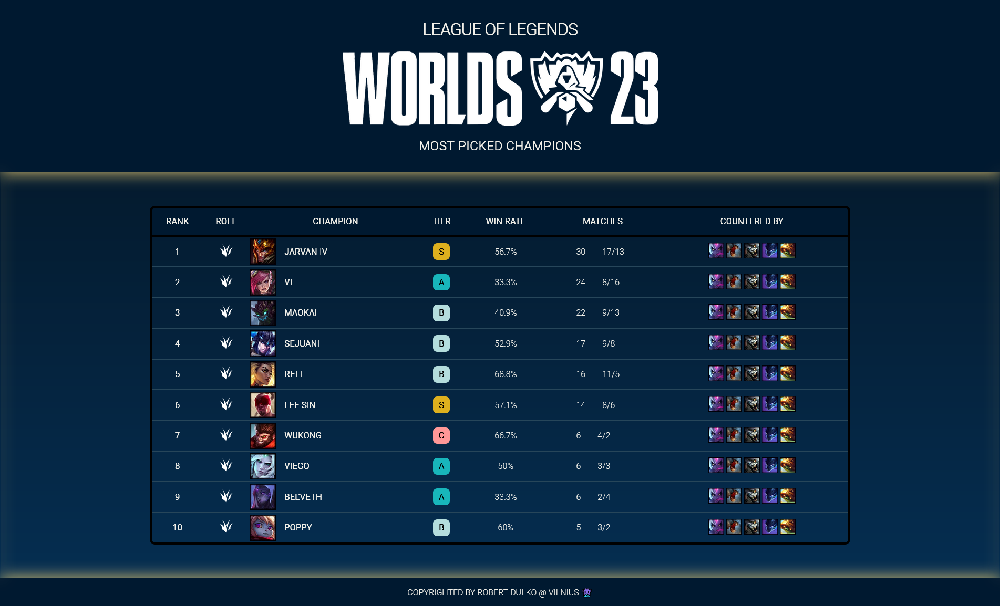

# LEAGUE OF LEGENDS WORLDS 23 Champion stats

Static site created with plain HTML and CSS for viewing champion stats at this years LEAGUE OF LEGENDS world championship.

This site was created as practice for using tables in HTML and using different CSS selectors.

## Things learned:

While doing this project I learned a lot about tables and how to better utilize CSS selectors.

### 1. You can create elements for selecting table columns 
With tag `<colgroup>` and `<col>` you can create elements that will represent table columns. These make styling columns much easier as you don't have to write complex selectors for columns. 

This method has some caveats. It can't apply all the styles for the column. Mostly it's used for specifying background color, horizontal and vertical alignment.

### 2. Vertically aligning text of an inline element *this could've been easier with just elements inside a flex box...*

I wanted to make a a letter with a certain background color for icons that represent the Tier of a champion. I wanted that letter to appear in the middle of that box. So I made the element for my tier icon `display: inline-block` and added `padding` but they seemed to look like capsules, so then I increased the `width` a little to make them look more square-like. 

Not too proud with the solution, so I hope in the future I want a better way to make an elements text be in the dead center.

### 3. Utilizing `flex` for filling up the whole space screen.

Often when making footers and headers we want them to appear at the bottom of the screen. When creating sites you will soon find out that the whole html and body fits the content. So if your content height is smaller than your viewport you have to use some tricks to make your website appear to take up the whole screen.

So I had to utilize `flex` to make the body of a page to take up the whole screen.
There were 3 main elements: `<header>`, `<main>` and `<footer>`. I wanted the header and the footer fit their content, while the body to take up the whole screen if there's space for. 

Respectfully I set the the `html` and `body` min height to 100% and make `body` `diplay: flex`

And then set the `flex` CSS parameter, which dictates the percent of vertical and horizontal space a flex element should take in regard of other elements.